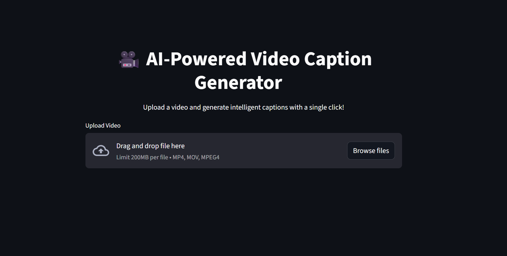

# Video Captioner

Video Captioner is a simple and modular Streamlit web app that automatically generates and embeds subtitles into any uploaded video. It uses OpenAI's Whisper model for transcription and FFmpeg to burn subtitles into the video.

---

## Features

- Transcribes audio from videos using Whisper
- Automatically extracts audio
- Burns subtitles into the video using FFmpeg

---
